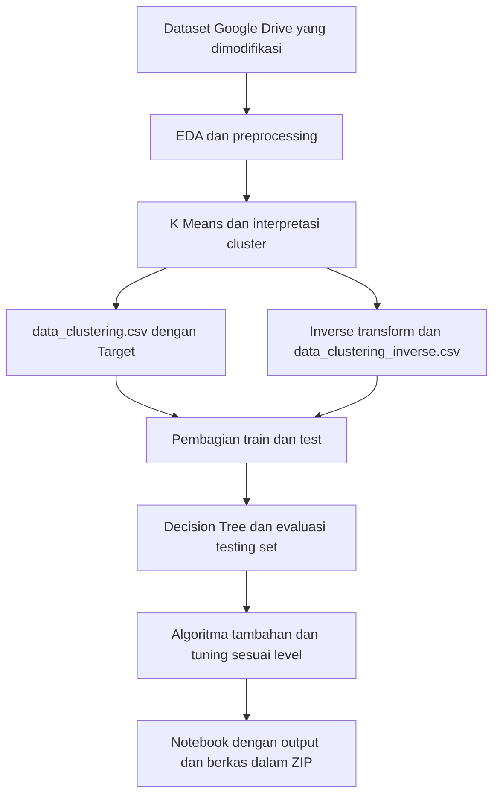

# Dokumentasi Submission Machine Learning BMLP

Dokumentasi ini mencakup dua tahap: clustering menghasilkan label `Target`, kemudian klasifikasi memprediksi label tersebut. Acuannya adalah pengantar, kriteria penilaian, dan ketentuan berkas submission yang dicatat pada 2 Oktober 2026. Pemeriksaan dimulai dari persyaratan Basic, kemudian berlanjut ke Skilled dan Advanced.

Kedua notebook tersedia di [proyek](../../README.md). Hasil eksperimen dan pemeriksaannya dicatat pada [laporan implementasi](../../reports/hasil-implementasi.md). Penilaian akhir dilakukan oleh reviewer kursus.

## Peta dokumen

| Dokumen | Isi dan kegunaan |
| --- | --- |
| [01 Pengantar dan ruang lingkup](01-pengantar.md) | Tujuan, dataset, template, batasan, dan hubungan dua notebook. |
| [02 Kriteria utama](02-kriteria.md) | Kelima kriteria dengan Basic, Skilled, Advanced, alasan reject, serta bukti yang perlu ditampilkan. |
| [03 Ketentuan penilaian](03-penilaian.md) | Rumus, konversi nilai, contoh perhitungan, dan strategi pencapaian. |
| [04 Alur pengerjaan notebook](04-alur-notebook.md) | Urutan cell dari sumber dan perpindahan data antara clustering dan klasifikasi. |
| [05 Tips dan penulisan analisis](05-tips-dan-analisis.md) | Saran teknis, penjagaan konsistensi data, dan pola metode–alasan–hasil. |
| [06 Ketentuan berkas submission](06-berkas-submission.md) | Nama file, status wajib atau bersyarat, ZIP, ekspor, dan proses review. |
| [07 Ambiguitas sumber](07-ambiguitas.md) | Ketidakkonsistenan teks dan interpretasi sementara yang dinyatakan secara terbuka. |
| [08 Checklist submission](08-checklist.md) | Daftar pemeriksaan Basic, peningkatan level, dan pengiriman. |
| [09 Sumber dan keterlacakan](09-sumber.md) | Salinan sumber, tautan resmi yang diberikan, referensi teknis, dan batas verifikasi. |
| [10 Panduan test manual](10-panduan-test-manual.md) | Setup VS Code/Jupyter, expected tiap tahap, Run All, pemeriksaan hasil, troubleshooting, dan ZIP. |
| [11 Lembar hasil test manual](11-lembar-hasil-test-manual.md) | Pencatatan sesi, status kasus, bukti, dan penyelesaian masalah oleh penguji manual. |

## Cara menggunakan dokumentasi

1. Baca pengantar untuk menetapkan dataset dan template.
2. Baca [ambiguitas](07-ambiguitas.md) sebelum menerjemahkan ketentuan menjadi kode.
3. Gunakan [kriteria](02-kriteria.md) sebagai acuan bukti, lalu kerjakan sesuai [alur notebook](04-alur-notebook.md).
4. Gunakan [tips](05-tips-dan-analisis.md) untuk menulis penjelasan pada markdown `Penilaian (Opsional)`.
5. Hitung estimasi melalui [penilaian](03-penilaian.md), kemudian periksa [berkas](06-berkas-submission.md) dan [checklist](08-checklist.md).

Setiap dokumen menautkan kembali ke indeks ini dan dokumen yang berkaitan. Kode **K1–K5** adalah penomoran kerja berdasarkan lima kelompok rubrik pada sumber, bukan judul resmi yang berhasil diverifikasi dari halaman kursus.

## Arti status dalam dokumen

- **Ketentuan sumber:** tertulis dalam materi pengguna; rujukan R1, R2, atau R3 tersedia di [daftar sumber](09-sumber.md).
- **Wajib bersyarat:** harus dipenuhi jika mengincar level tertentu. Label opsional pada template tidak menghapus kewajiban Basic.
- **Saran teknis:** rekomendasi pendamping, bukan tambahan rubrik resmi.
- **Interpretasi sementara:** pilihan kerja ketika sumber bertentangan; belum merupakan konfirmasi reviewer.

Cabang inverse berlaku untuk K4 Advanced. Algoritma tambahan berlaku untuk K5 Skilled, sedangkan tuning berlaku untuk K5 Advanced. Rincian kontrak data ada di [alur notebook](04-alur-notebook.md).
