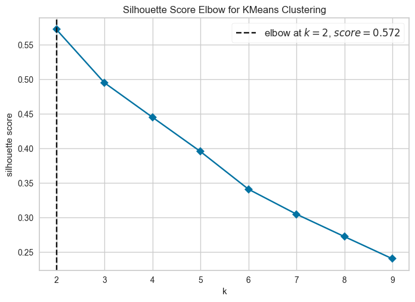
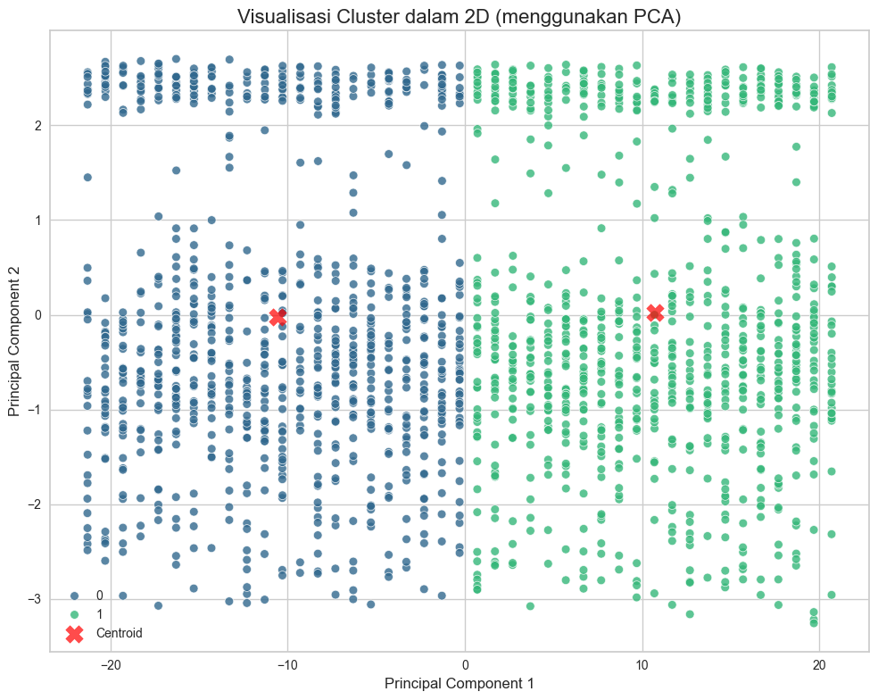

# Hasil implementasi submission Machine Learning

[Proyek](../README.md) · [ZIP final](../dist/BMLP_Arief_Maulana.zip) · [Dokumentasi ketentuan](../docs/submission/README.md) · [Metrik](metrics.json)

Implementasi disiapkan pada 2 Oktober 2026 untuk seluruh kriteria Advanced. Dua notebook berasal dari template asli, telah dieksekusi dari kernel baru, dan memuat output serta analisis aktual. Laporan ini menjelaskan hasil dan keterbatasan yang perlu dipahami sebelum mengirim ZIP.

## Sumber dan lingkungan eksekusi

Template diunduh dari tautan Colab pada ketentuan berkas submission. Dataset `bank_transactions_data_edited.csv` diunduh dari file ID `1gnLO9qvEPqv1uBt1928AcsCmdvzqjC5m` dalam folder Google Drive kursus. Salinan sumber dan hash tersedia pada [manifest](manifest.json).

Python 3.12.14, scikit-learn 1.7.0, pandas 2.2.3, NumPy 2.2.6, SciPy 1.15.3, Yellowbrick 1.5, dan joblib 1.5.1 digunakan. Setuptools menyediakan kompatibilitas distutils yang dibutuhkan Yellowbrick pada Python 3.12. Cache dan konfigurasi runtime diarahkan ke workspace tanpa menambah import pada notebook.

Deskripsi bawaan template menyebut 2.512 sampel. Snapshot aktual memiliki **2.537 baris, 16 kolom, 403 sel kosong, dan 21 duplikat**. Markdown informasi dataset serta gambar expected output asli dipertahankan sebagai bagian template; analisis tambahan menjelaskan hasil aktual.

## Bukti terhadap lima kriteria

| Kriteria | Bukti implementasi yang tersedia |
| --- | --- |
| K1 Advanced | head, info, describe, matriks korelasi, histogram lima fitur numerik, distribusi seluruh sebelas fitur kategorikal, boxplot, violinplot, label grafik yang dirapikan. |
| K2 Advanced | isnull dan duplicated, dropna, drop_duplicates, penghapusan tujuh kolom ID/IP/date, LabelEncoder terpisah, drop outlier IQR, StandardScaler, qcut CustomerAge tiga rentang dengan encoding. |
| K3 Advanced | KElbowVisualizer metric silhouette k=2–9, K-Means utama, silhouette, visualisasi PCA, K-Means baru pada dua komponen PCA, dua artefak model. |
| K4 Advanced | Mean/min/max sebelum dan sesudah inverse, narasi seluruh cluster, mode seluruh kategori termasuk bin umur, dua CSV dengan Target yang sama. |
| K5 Advanced | CSV inverse, One Hot Encoding bawaan, split stratifikasi, Decision Tree, Random Forest, empat metrik setiap model, GridSearchCV, evaluasi model tuning, artefak wajib. |

Tabel menunjukkan bukti pengerjaan, bukan pemberian skor resmi. Distribusi nominal ditampilkan sebagai frekuensi kategori karena kategori seperti kota tidak memiliki interval numerik alami. Semua kategori dicakup; label tick dijarangkan untuk kolom berkardinalitas tinggi agar tidak overlap.

## Preprocessing dan keterlacakan baris

| Tahap | Baris tersisa | Baris dihapus pada tahap ini |
| --- | --- | --- |
| Data awal | 2.537 | — |
| dropna | 2.156 | 381 |
| drop_duplicates | 2.135 | 21 |
| IQR TransactionAmount | 2.042 | 93 |
| IQR CustomerAge | 2.042 | 0 |
| IQR TransactionDuration | 2.042 | 0 |
| IQR LoginAttempts | 1.945 | 97 |
| IQR AccountBalance | 1.945 | 0 |

Filter IQR dijalankan berurutan sesuai template, sehingga batas fitur berikutnya dihitung pada baris yang masih bertahan. Untuk LoginAttempts, IQR nol menghasilkan batas 1–1; observasi dengan lebih dari satu percobaan login dihapus. Ini dapat menghilangkan sinyal yang penting untuk investigasi fraud, sehingga hasil tidak diklaim sebagai model fraud yang tervalidasi.

Kolom yang dihapus: TransactionID, AccountID, TransactionDate, DeviceID, IP Address, MerchantID, PreviousTransactionDate. Binning CustomerAge mempertahankan fitur asal dan menambah CustomerAgeGroup. Rentang pada skala asli adalah 18–32, lebih dari 32–55, dan lebih dari 55–80 tahun, mengikuti kuantil data bersih. Nama Muda/Dewasa/Senior merupakan nama relatif dalam distribusi ini.

## Hasil clustering

| Model | Jumlah cluster | Silhouette | Ruang perhitungan |
| --- | --- | --- | --- |
| K-Means utama | 2 | 0,572160 | Sepuluh fitur hasil preprocessing. |
| K-Means PCA | 2 | 0,601743 | Dua komponen utama. |

Dua komponen PCA menjelaskan **97,3178%** varians. Silhouette pada dua ruang berbeda tidak menjadi bukti tunggal model PCA lebih baik untuk semua tujuan. `Target` pada kedua CSV tetap berasal dari K-Means utama.

| Cluster | Anggota | Mean usia | Rentang usia | Mean nilai transaksi | Rentang nilai transaksi | Kota unik |
| --- | --- | --- | --- | --- | --- | --- |
| 0 | 980 | 45,0551 | 18–80 | 255,5479 | 0,32–903,19 | 22 |
| 1 | 965 | 44,3254 | 18–80 | 258,1487 | 0,26–889,01 | 21 |

Perbedaan rata-rata usia kedua cluster sekitar 0,73 tahun, sedangkan perbedaan rata-rata nilai transaksi sekitar 2,60. Keduanya memiliki rentang usia 18–80 tahun. Pembagian terutama berkaitan dengan kode kategori Location: fitur ini menyumbang **95,7262%** dari jumlah varians fitur masukan. Selisih kode LabelEncoder pada nama kota tidak menunjukkan jarak geografis. Ringkasan mean/min/max dan mode setiap cluster tersedia pada notebook.

## Hasil klasifikasi dan tuning

Data klasifikasi berasal dari `data_clustering_inverse.csv`, kemudian diubah melalui cell One Hot Encoding yang sudah tersedia pada template. Sebanyak 55 fitur dipakai; `Target` dikeluarkan dari X. Split 80/20 dengan random_state=42 dan stratify menghasilkan 1.556 training serta 389 testing.

| Model | Accuracy testing | Precision macro | Recall macro | F1 macro |
| --- | --- | --- | --- | --- |
| Decision Tree | 1,0000 | 1,0000 | 1,0000 | 1,0000 |
| Random Forest 200 pohon | 1,0000 | 1,0000 | 1,0000 | 1,0000 |
| Random Forest tuning | 1,0000 | 1,0000 | 1,0000 | 1,0000 |

GridSearchCV menguji 18 kombinasi: n_estimators 100/200, max_depth None/8/16, dan min_samples_leaf 1/2/4. Lima fold menggunakan training set dengan scoring accuracy sesuai template. Parameter terbaik adalah n_estimators=200, max_depth=None, min_samples_leaf=1; mean accuracy CV terbaik 1,0. Model tuning tidak dipilih ulang berdasarkan testing set.

Skor sempurna masuk akal untuk label yang dapat dipisahkan menurut kategori lokasi. Pemeriksaan memastikan `Target` tidak dimasukkan sebagai fitur. Namun, preprocessing dan pembuatan label clustering sudah menggunakan dataset penuh sebelum split klasifikasi sebagaimana tugas; kosakata One Hot Encoding juga mengikuti urutan template. Hasil merupakan kemampuan mereplikasi cluster pada dataset ini, bukan evaluasi menyeluruh pipeline pada data baru atau ground truth fraud.

## Verifikasi dan pengemasan

Pemeriksaan integrasi mencakup jumlah code cell dan import yang sama dengan template, output eksekusi berurutan tanpa error, markdown asli dipertahankan kecuali isian jawaban, keselarasan label, inverse kembali ke observasi sumber yang benar, prediksi model clustering sesuai Target, kesamaan fitur dan holdout classifier, konsistensi metrik, serta isi ZIP identik dengan artefak final.

Sebanyak 17 grafik hasil eksekusi diekstrak untuk audit visual. Label, sumbu, dan legenda diperiksa melalui tiga lembar ringkasan. Plot tidak menghilangkan kategori berkardinalitas tinggi demi keterbacaan.

ZIP berisi sepuluh file: dua notebook, lima model, dua CSV hasil clustering, serta CSV mentah resmi untuk Run All offline. Model opsional `best_model_classification.h5` tidak dilampirkan karena tidak diperlukan rubrik dan tidak menggantikan artefak mandatory. Tidak ada file sumber script, cache, atau environment yang dimasukkan ke ZIP.

## Keputusan yang menyelesaikan ketidakjelasan template

- Template klasifikasi memang memiliki cell One Hot Encoding, sehingga kebutuhan kategori string pada CSV inverse dapat ditangani tanpa menambah code cell.
- Template PCA secara eksplisit meminta K-Means baru yang dilatih pada data dua komponen; `PCA_model_clustering.h5` berisi estimator K-Means tersebut.
- Binning menambah kolom baru dan tidak mengganti fitur numerik asal, sehingga inverse numerik tetap dapat memulihkan nilai asli.
- Interpretasi sebelum dan sesudah inverse diisi pada dua slot jawaban asli. Markdown tambahan `Penilaian (Opsional)` mengikuti panduan submission, walaupun teks peringatan awal template lebih ketat.
- Penyesuaian di dalam code cell yang tersedia hanya mendukung kelengkapan rubrik, keterbacaan, determinisme, evaluasi, dan bukti penyimpanan. Import asli serta jumlah code cell tetap sama.

Catatan konflik teks dan interpretasi lain tetap tersedia di [dokumen ambiguitas](../docs/submission/07-ambiguitas.md). Nilai resmi serta keputusan penerimaan diberikan oleh reviewer kursus.
